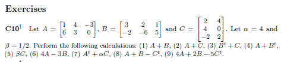

```{r include=FALSE}

#definign the aprams
Alpha = 4
Beta = 1/2

#defining the matrix
A <- matrix(c(1, 6, 4, 3, -3, 0), 2, 3)
B <- matrix(c(3, -2, 2, -6, 1, 5), 2, 3)
C <- matrix(c(2, 4, -2, 4, 0, 2), 3, 2)

#To trasnpose the matrix
A1 <- t(A) 
B1 <- t(B) 
C1 <- t(C) 

```
---

(1) A + B  
    ```{r}
    A+B
    ```  


(2) A + C  
    ```{r}
    #A+C
    ```  
    A and C are not the same size.A+C is not defined. 


(3) B^t + C  
    ```{r}
    B1 + C
    ```  


(4) A + B^t  
    ```{r}
    #A + B1
    ```  
    A and B^t are not the same size. A + B^t is not defined.

(5) (BetA)C  
    ```{r}
     Beta * C
    ```  
    

(6) 4A - 3B  
    ```{r}
    4 * A - 3 * B
    ```  
    

(7) A^t + (Alpha)C  
    ```{r}
    A1 + (Alpha * C)
    ```  


(8) A + B -C^t  
    ```{r}
    A + B - C1
    ```  


(9) 4A + 2B - 5C^t.
    ```{r}
    4*A + 2*B - 5 * C1
    
    ```  

---