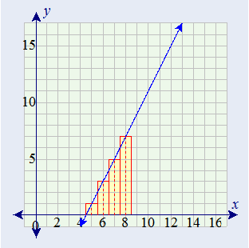

```{r setup, include=FALSE}
knitr::opts_chunk$set(echo = TRUE)
```


### Home Work 13


1. Use integration by substitution to solve the integral below.

\[ \int 4e^{-7x}dx \]

Let u = -7x 

\[ \frac{du}{dx}=−7 \]

\[du=−7dx \]

\[dx=\frac{du}{−7}=−\frac{1}{7}du \]

\[ = −\frac{4}{7} \int e^udu \]

\[ = \frac{4}{7}e^u \]

\[ = \frac{4}{7}e^{−7x}+C \]

---

2. Biologists are treating a pond contaminated with bacteria. The level of contamination is changing at a rate of $\frac{dN}{dt} = -\frac{3150}{t^4} - 220$  bacteria per cubic centimeter per day, where t is the number of days since treatment began. Find a
function $N( t )$ to estimate the level of contamination if the level after 1 day was 6530 bacteria per cubic centimeter.  

\[ N′(t)=\frac{dn}{dt}= \int (−\frac{3150}{t^4}−220)dt \]

\[ N(t)=\frac{1050}{t^3}−220t+C \]

\[ N(1)=1050−220+C=6530 \]

\[ C=5700 \]

\[ N(t)=\frac{1050}{t^3}−220t+5700 \]


---  

3. Find the total area of the red rectangles in the figure below, where the 3. equation of the line is $f ( x ) = 2x - 9$ .  

     
    
    ==>  
    
    \[ \int_4.5^8.5 2x - 9dx \]  
    \[ = [ x^2 - 9x ] |_4.5^8.5  \]  
    \[ = (8.5^2 - 9(8.5)) - ( 4.5^2 - 9(4.5))  \]  
    \[ = 16 \]
    
    ***Area = 16***

---  

4. Find the area of the region bounded by the graphs of the given equations.
\[y = x^2 - 2x - 2, y = x + 2 \]


    Enter your answer below: 

    ```{r}
    Y = function(x) {x + 2}
    Y1 = function(x) {x^2 -2*x -2}
    ay <- integrate(Y, -1, 4)
    ay1 <- integrate(Y1, -1, 4)
    (area <- round((ay$value - ay1$value),4))
    
    paste0("Area of the region bounded by the graphs of the given equations is " , round(area, 4))
    ```

---  

5. A beauty supply store expects to sell 110 flat irons during the next year. It costs $3.75 to store one flat iron for one year.
There is a fixed cost of $8.25 for each order. Find the lot size and the number of orders per year that will minimize
inventory costs.   

Let x be a number of flat irons,  
Yearly storage cost = Storage cost per iron × Average number of irons = $3.75 * \frac{x}{2}=1.875x$  
Yearly ordering cost = Cost of each order × Number of orders = $8.25 * \frac{110}{x}=\frac{907.5}{x}$  
Inventory cost = Yearly storage cost + Yearly ordering cost = $1.875x+\frac{907.5}{x}=f(x)$  

\[ f′(x) = 1.875− \frac{907.5}{x^2}=0 \]

\[ 1.875 = \frac{907.5}{x^2}   \]

\[ x^2 = \frac{907.5}{1.875}   \]

\[ x = \sqrt\frac{907.5}{1.875}   \]

\[ x = \sqrt484   \]

\[ x = 22   \]

\[ Lot Size = 22 ; Order = \frac{110}{22} = 5   \]

---  

6. Use integration by parts to solve the integral below.

\[ \int \ln(9x) . x^6dx \]

Let $u = ln(9x)$ then $\frac{du}{dx} = \frac{1}{x}$

Let $\frac{du}{dx} = x^6$ then $v = ∫x^6dx= \frac{1}{7} x^7$ 


\[∫ln(u)∗(v)=uv−∫vdu \]

\[\frac{ln(9x)x^7}{7}−\frac{1}{7}∫x^6dx \]

\[\frac{7}{49}x^7.ln(9x)−\frac{1}{49}x^7+C \]
 
\[\frac{1}{49}(7ln(9x)−1)+C \]

 
---  

7. Determine whether $f ( x )$ is a probability density function on the interval $[ 1, e^6 ]$. If not, determine the value of the
definite integral.

\[ f(x) = \frac{1}{6x} \]

\[ \int _1^{e^6} \frac{1}{6x}dx=\frac{1}{6x}ln(x)|_{1}^{e^6} \]

\[ \frac{1}{6x}ln(e^6)−\frac{1}{6x}ln(1)=1 \]

Since the definite integral is 1, $f(x)$ is a probability density function on the interval $[1,e^6]$

---