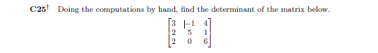

  
  
---
```{r}
#defining the matrix:
A <- matrix(c(3, 2, 2, -1, 5, 0, 4, 1, 6), 3, 3)
A
#Doing manually :
(3 *(5*6 - 1*0) ) - ( -1 *(2*6 - 2*1) ) + ( 4 *(2*0 - 2*5))

#Using R funtion to validate the output:
det(A)
```  
---