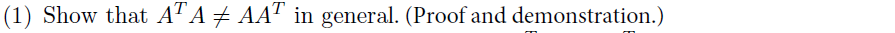
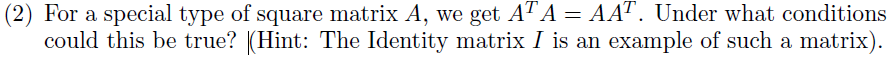
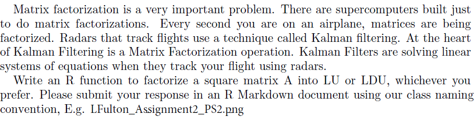

```{r setup, include=FALSE}
knitr::opts_chunk$set(echo = TRUE)
library(matlib)
```

## Problem set 1   
  
    
  
```{r}
#defining the sample matrix:
A <- matrix(c(3, 2, 2, -1, 5, 0, 4, 1, 6), 3, 3)
A
A1 <- t(A)
A1
    
#Checking by comparing the Matrix side by side. 
A1 %*% A
A %*% A1
    
#Checking with NOt equal to operator '!='
A1 %*% A != A %*% A1  
```   
***==> From above two methods we can say that A1 %*% A and A %*% A1, are not equal in this case***  
  
\newpage

  
  
```{r}
#defining the square  matrix:
A <- matrix(c(2, 0,2, 0, 2, 0, 2, 0, 2), 3, 3)
A
A1 <- t(A)
A1

#Checking if A == A1
A == A1
    
#Checking by comparing the Matrix side by side. 
A1 %*% A
A %*% A1
    
#Checking with equal to operator '=='
A1 %*% A == A %*% A1  
```   
***==> When A and A1 are same then we can get A1 %*% A and A %*% A1 as equal***  
        

\newpage

## Problem set 2    
   
     
      
       
```{r}
#defining the square  matrix:
A <- matrix(c(2, 6, -2, -1, 5, 0, 4, 1, 6), 3, 3)
A

#Getting cell 2, 1 as 0 
A21 <- matrix(c(1, -(6/2), 0, 0, 1, 0, 0, 0, 1), 3, 3)
A21  %*%  A 

#Getting cell 3, 1 as 0 
A31 <- matrix(c(1, 0, -(-2/2), 0, 1, 0, 0, 0, 1), 3, 3)
A31  %*% A21  %*%  A 

#Getting cell 3, 2 as 0 
A32 <- matrix(c(1, 0, 0, 0, 1, -(-1/8), 0, 0, 1), 3, 3)
A32 %*% A31  %*% A21  %*%  A 

#Upper Triangular matrix U
U  <- A32 %*% A31  %*% A21  %*%  A 
U

#Lower Triangular matrix L
L <- solve(A21) %*%  solve(A31)  %*% solve(A32) 
L

#Checking for factorize for square matrix A into LU
A == L %*% U
```   

---
