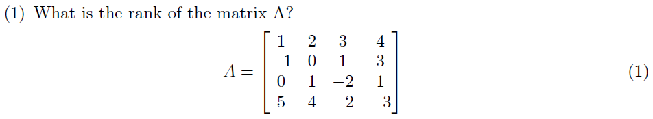
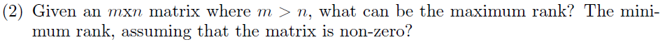
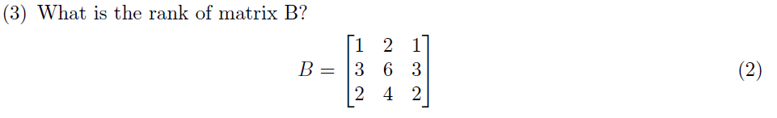
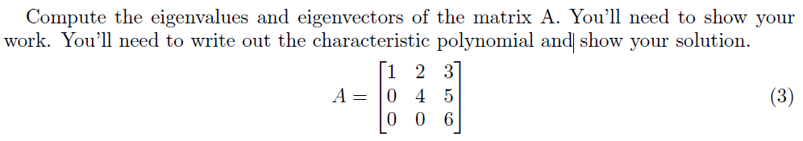
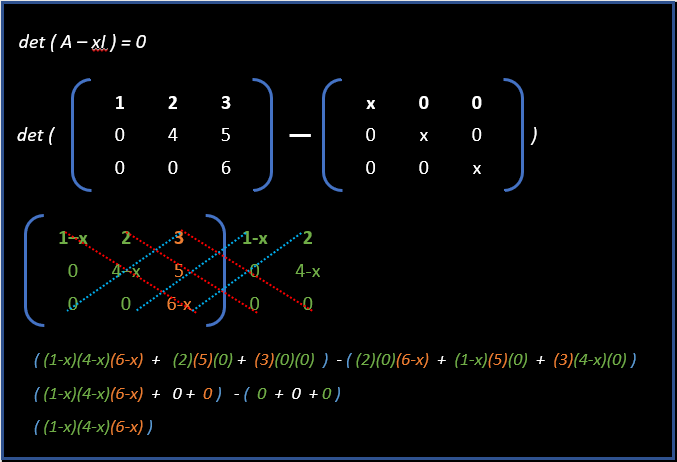

```{r setup, include=FALSE}
knitr::opts_chunk$set(echo = TRUE)
library(matlib)
```

## Problem set 1   
  
    
  
```{r}
#defining the sample matrix:
A <- matrix(c(1, -1, 0, 5, 2, 0, 1, 4, 3 ,1, -2, -2, 4, 3, 1, -3), 4, 4)
A

#run the function qr() 
qr(A)$rank

#Alternative: load the Matrix package...
require(Matrix)

#and run the function rankMatrix()
rankMatrix(A)[1]

```   

---    

\newpage

  
  
  
***==> For an **mxn** matrix (assuming that the matrix is non-zero) where **m > n** ; the maximum rank can be **n**. ***  
   
---        

\newpage

  
  
```{r}
#defining the square  matrix:
A <- matrix(c(1, 3, 2, 2, 6, 4, 1, 3, 2), 3, 3)
A

#run the function qr() 
qr(A)$rank

#Alternative: load the Matrix package...
require(Matrix)

#and run the function rankMatrix()
rankMatrix(A)[1]

```   

---

\newpage

## Problem set 2    
   
     
      
           
```{r}
#defining the square  matrix:
A <- matrix(c(1, 0, 0, 2, 4, 0, 3, 5, 6), 3, 3)
A

#eigen fucntion:
e <- eigen(A)

#eigenvalues:
e$values
```
    

```{r}
#eigenvectors:
e$vectors

```   

---
