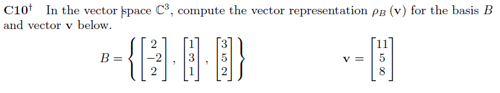

  
  
---
```{r}
#defining the matrix B and v:
B <- matrix(c(2, -2, 2, 1, 3, 1, 3, 5, 2), 3, 3)
B
v <- matrix(c(11, 5, 8), 3, 1)
v

# With augmented matrix we have as below:
A <- matrix(c(2, -2, 2, 1, 3, 1, 3, 5, 2, 11, 5, 8), 3, 4)
A

Arref <- pracma::rref(A)
Arref

pB.v <- matrix(Arref[,4 ], 3, 1)
pB.v

```  
---