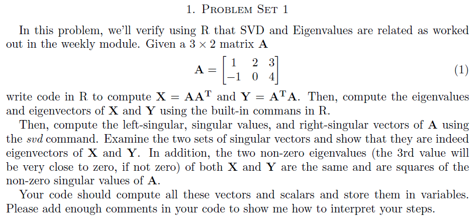
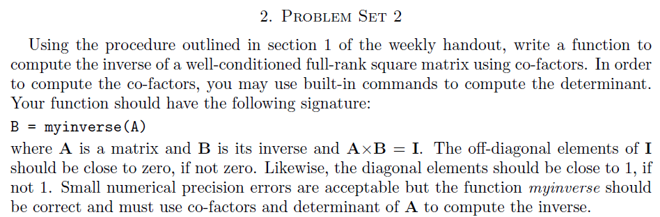

```{r setup, include=FALSE}
knitr::opts_chunk$set(echo = TRUE)
library(matlib)
```

## Problem set 1   
  
    
  
```{r}
#defining the matrix:
A <- matrix(c(1, -1, 2, 0, 3, 4), 2, 3)
A

# Compute X and Y using built-in commands
X <- A%*%t(A)
X
Y <- t(A)%*%A
Y

# compute eigenvalues and eigenvectors
eigen_X <- eigen(X)
eigen_X
eigen_Y <- eigen(Y)
eigen_Y

# compute the left-singular, singular values, and right-singular vectors of A using the 'svd()' command. 
# v = right, u = left
svd_A <- svd(A)
svd_A 


# Compare the left singular vector u to the eigenvectors of x
eigen_X$vectors
svd_A$u
round(abs(eigen_X$vectors)) == round(abs(svd_A$u))
```
**==> We can see that the vectors are same; except that one of the vectors is multiplied by a scalar of -1. Thus the left singular vectors are the eigenvectors of X.**  

```{r}  
# Compare the right singular vector v to the eigenvectors of x
eigen_Y$vectors
svd_A$v
round(abs(eigen_Y$vectors[1:3, 1:2])) == round(abs(svd_A$v))  #Comparing frist two column data only
```
**==> We can see that the vectors are same; Thus the right singular vectors are the eigenvectors of Y.**  

```{r}  
# all.equal -- compare R objects x and y testing ‘near equality’
all.equal(eigen_X$values, (svd_A$d)^2)
all.equal(eigen_Y$values[1:2], (svd_A$d)^2)   #Comparing frist two data only
```   

---    

\newpage  

## Problem set 2  

     
  

```{r}
#reference : https://www.mathsisfun.com/algebra/matrix-inverse-minors-cofactors-adjugate.html
myinverse <- function(A) {

  #Check to see if the matrix is invertible:
  if (det(A) == 0) {
    stop('This matrix is non-invertible. Try another!')
  }
  
  inverse_A <- diag(0, nrow=nrow(A), ncol=ncol(A))
  
  
  #Step 1: Matrix of Minors:
    #For each element of the matrix:
    #  1. ignore the values on the current row and column
    #  2. calculate the determinant of the remaining values
    #Put those determinants into a matrix (the "Matrix of Minors")
  
    for(i in 1:nrow(A))
    {
      for(j in 1:ncol(A))
      {
        inverse_A[i,j] <- det(A[-i,-j]) # fill the rows and columns
      }
    } 
  
  
  #Step 2: Matrix of Cofactors:
    #Temperory copy of inverse_A
    temp_A <- inverse_A
    
    #Starting  the sign for frist row with +1
    sign_multiple_row = +1
    for(i in 1:nrow(A))
    {
      #setting sign for first column in row
      sign_multiple_col = sign_multiple_row 
      for(j in 1:ncol(A))
      {
        inverse_A[i,j] <- sign_multiple_col*(temp_A[i,j]) # fill the rows and columns
        #flipping sign for next column in row
        sign_multiple_col = sign_multiple_col * -1
      }
      #flipping the sign for next row
      sign_multiple_row = sign_multiple_row * -1 
    } 
  
    
  #Step 3: Adjugate (also called Adjoint or Transpose):
    inverse_A = t(inverse_A)
  
    
  #Step 4: Multiply by 1/Determinant:
    inverse_A = inverse_A * (1/det(A))
  
    
  return(inverse_A)
  
}
```

**==> We can test it as below: **  
```{r}  
# Try it out 
A = matrix(c(3, 2, 0, 0,0, 1, 2, -2, 1), 3, 3)
A
B <- myinverse(A)
B

# We can crosscheck the answer using solve():
s_A <- solve(A)
round(s_A,2) == round(B,2)
```


---

