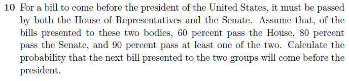

### Exercise- Discrete Probability Distributions - 1.2 10

   
   
  
### Solution:  

Let P(S) denote the probability that a bill passes the Senate; let P(H) denote the probability that a bill passes the House of Representatives.  
  
we have as below:  
  
  P(H $\cup$ S) = P(H) +P(S) − P(H $\cap$ S)  
  
  
Solving for P(H$\cap$S) yields  
  
  P(H $\cap$ S) = P(H) + P(S) − P(H $\cup$ S)  
  
Substituting 0.6 for P(H), 0.8 for P(S), and 0.9 for P(H $\cup$ S) yields  
    
  P(H $\cap$ S) = 0.6 + 0.8 − 0.9   = 0.5  
  
The probability that the next bill presented to the two groups will come before the president is 0.5    
  

---
