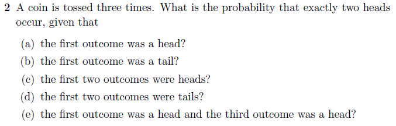

### Exercise- CONDITIONAL PROBABILITY - #2

   
   
  
### Solution:    
  
    A Coin can land as Head (H) or Tail (T); two choices. With three tosses, we can have belwo combinations:  
  
    2 x 2 x 2  =  8 combinations  as below  
      
    1. H H H  
    2. H H T  
    3. H T H  
    4. H T T  
    5. T H H  
    6. T H T  
    7. T T H  
    8. T T T  
    
    We can now solve the below as:  
    
    What is the probability that exactly two heads occur, given that
    
    (a) the first outcome was a head?  
    ==> We have **two** combinations with exactly two heads with first outcome as head -  H H T  and, H T H.
    ==> P(a) = 2/8 = 0.25
      
    (b) the first outcome was a tail?
    ==> We have **one** combination with exactly two heads with first outcome as tail -  T H H.
    ==> P(b) = 1/8 = 0.125
      
    (c) the first two outcomes were heads?
    ==> We have **one** combination with exactly two heads with first two outcomes as heads -  H H T.
    ==> P(c) = 1/8 = 0.125
      
    (d) the first two outcomes were tails?
    ==> We will have **zero** combinations with exactly two heads with first two outcomes as tails.
    ==> P(d) = 0/8 = 0.0
      
    (e) the first outcome was a head and the third outcome was a head?
    ==> We have **one** combinations with exactly two heads with first and the third outcome as a head -  H T H.
    ==> P(e) = 1/8 = 0.125
      
---
